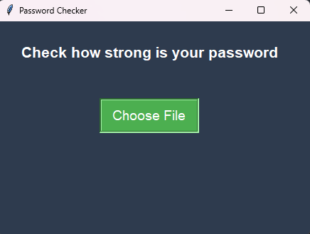
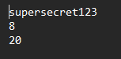
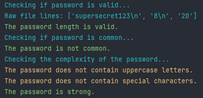

# PassCheck - Check how strong is your password

- A simple project within the scope of Secure Software Development Techniques, Universidade Lusófona.
___
## **Introduction**

All online accounts (and not only) always need a password associated with them. 
Having a strong password strengthens the security of a given account, 
preventing anyone from trying to access it without authorization. 
One of the most common attacks is using Brute Force.
Nowadays, when a new user registers a new account, many websites provide minimum 
password parameters to avoid this type of problem, contributing to greater security.
However, not all applications have this feature.

## **Installation Guide**

You can either download this content or use `git clone` and open the program in PyCharm for example.

## **How to start**

Before running the program, make sure you have Python installed on your machine and 
install the packages necessary to run the program.
When you run the program, a window will open where you can select the txt file with the password and its parameters.

The file must be in the following format:
The first line must contain the password to be checked,
the second line must contain the minimum length of the password
and the third line must contain the maximum length.

After selecting the file, the program will pass through various verifications and give you a result.

## **Parameters**

Here's a complete graphic showing what verifications are made to the given password:

Function | Explanation
:---: | ---
`choose_file` | Function used to open a file dialog and insert the txt file.
`read_parameters` | Reads the password and its length requirements.
`validate_password` | Checks if the password is within the length given.
`password_wordslist` | Checks if the password is in a common wordslist from Kali Linux called rockyou.
`check_password_complexity`| Determines how strong is the password based on some conditions: length, if it has as least one digit, uppercase and lowercase letters and special characters.
`check_repeated_characters` | Checks if the password has repeated characters.
`check_palindrome` | Checks if the password is a palindrome. A palindrome is a word, phrase, number, or other sequence of characters that reads the same forward and backward.